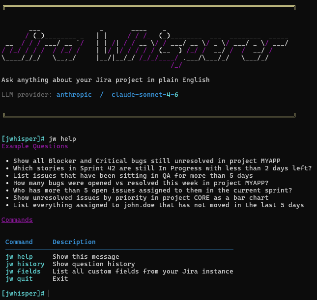

# Jira Whisperer


Tired of writing JQL just to find out what your team is working on? Jira Whisperer lets you talk to your Jira like a colleague — type a question the way you'd say it out loud, and get a clear answer back.

No dashboards to configure. No filters to save. No JQL to learn.

> *"Show me all the bugs opened this quarter"*
> *"Which issues spent more than 10 days in QA last sprint?"*
> *"List everything assigned to john.doe that's still open"*

Under the hood, an LLM (Anthropic Claude by default) converts your question into a JQL query, runs it against your Jira, and then reads the results back to you in plain English — like having a data analyst on call.


<br>

## Preview




<br>


<br>

## Requirements

| Tool | Version |
|------|---------|
| Python | 3.12+ |
| [uv](https://docs.astral.sh/uv/) | latest |
| LLM API key | Anthropic by default; any OpenAI-compatible provider supported |
| Jira Cloud or Server v9 | REST API v2 |

<br>

## Setup

**1. Clone the repository**
```bash
git clone https://github.com/your-org/jira-whisperer.git
cd jira-whisperer
```

**2. Install dependencies**
```bash
uv sync
```

**3. Configure environment**
```bash
cp .env.example .env
# Edit .env with your credentials
```

**4. Run**
```bash
uv run python main.py
```

<br>

## Usage

```
[jwhisper]# Show all open bugs in project KAFKA created this quarter
[jwhisper]# Find issues that spent more than 10 days in QA last sprint
[jwhisper]# List unresolved blockers assigned to john.doe@company.com
[jwhisper]# jw help       — show example queries
[jwhisper]# jw history    — show question history
[jwhisper]# jw quit       — exit
```

<br>

## Configuration

All settings are loaded from `.env` via `src/config.py`.

| Variable | Required | Purpose |
|----------|----------|---------|
| `JIRA_BASE_URL` | Yes | Jira base URL, no trailing slash |
| `JIRA_USER` | No | Username / email (omit for public instances) |
| `JIRA_API_TOKEN` | No | API token (omit for public instances) |
| `ANTHROPIC_API_KEY` | Yes | LLM API key (Anthropic by default) |
| `MODEL_NAME` | No | Model ID to use (default: `claude-opus-4-6`) |
| `JIRA_DEFAULT_PROJECT` | No | Default project key used in JQL when none specified |

> Set `level=logging.DEBUG` in `main.py` to print the full Jira request URL on every call — paste it directly into a browser to verify the query manually.

<br>

## Running Tests

Tests are integration tests that run against real APIs using credentials from `.env`.

```bash
uv run pytest test/test_pipeline -v -s
```

> `ANTHROPIC_API_KEY` (or your LLM provider's key) and `JIRA_BASE_URL` must be set before running tests.
